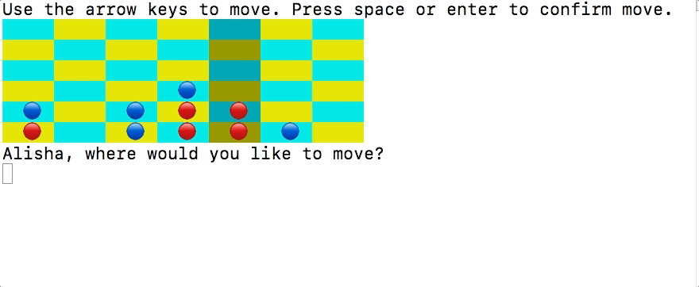

# Connect Four

Play Connect Four against a custom-built Computer AI! This game uses Ruby and is played in the console.

## Instructions

1. Install ruby if you do not already have it.
2. Download the [zip file](https://github.com/alikew24/ConnectFour/archive/master.zip)
3. Unzip the zip file. In the terminal, navigate to the ConnectFour-master directory.
4. Type 'bundle install' in the console.
5. Type 'ruby game.rb' to start the game!

## How To Play

Learn more about the rules of Connect Four [here](https://en.wikipedia.org/wiki/Connect_Four).
The goal of the game is to place 4 of your chips in a row.
The first person to get four-in-a-row wins!

To play, simply use the arrow keys to move to a different column. Press the enter key
when you have selected the column that you want to place your chip.
Your chips are red and the Computer's chips are blue.

## Future Directions
The Computer AI uses simple logic to determine whether one of the players
is about to win. In the future, I would like to implement the minimax algorithm
so that the Computer AI can make more better, more complex decisions.
